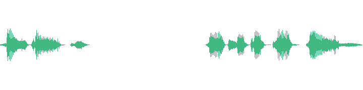

# IndexTTS2-PauseControl

> **English**: [README_EN.md](README_EN.md)

## 这是什么

IndexTTS2 是一款出色的语音合成模型，但它有个"小脾气"：**语音里的停顿长短
由模型随机决定**——同一个逗号，这次停 200ms，下次可能停 500ms，无法按你的
要求来。

本工具（ComfyUI 节点包）解决了这个问题：**在文本里直接写停顿要求**：

```
他停下脚步[pause:800ms]深吸一口气[pause:200ms]然后推开了那扇门。
```

生成后，"停下脚步"和"深吸一口气"之间的停顿**就是 800ms**，"深吸一口气"
之后**就是 200ms**——实测平均偏差 13ms（约 1/80 秒，人耳无法分辨）。
**句号处的停顿同样可以精确控制**。

不需要改模型、不需要重新训练，装上节点即可用。

## 安装

### 方式一：完整包（开箱即用，推荐）

1. 将本仓库目录（即 `IndexTTS2-PauseControl/`）放到 ComfyUI 的 `custom_nodes/` 下，
   目录名保持 `IndexTTS2-PauseControl`
   （⚠️ 如已存在同名目录请先备份——覆盖会替换旧内容）
2. 安装依赖到 ComfyUI 的 Python 环境（见 `requirements.txt`）
3. 运行 `python install.py`（自动装依赖 + 检查模型目录），或手动按 `requirements.txt` 安装
4. 下载 IndexTTS2 模型权重到 `ComfyUI/models/index_tts/`
   （模型来源见官方 [index-tts/index-tts](https://github.com/index-tts/index-tts)，权重不属于本仓库）
5. 重启 ComfyUI

> 也支持 **ComfyUI-Manager** 一键安装（搜索 `IndexTTS2-PauseControl`）。
>
> ⚠️ 请以**目录方式运行**（放 `custom_nodes/` 下），**不要 `pip install .`**——本项目
> 包名与官方 `indextts` 同名，pip 安装会覆盖官方推理包。

### 方式二：打补丁（已有官方 indextts 包的用户）

如果你已有官方 IndexTTS2 推理代码（官方整合包 / 官方 ComfyUI 节点 / 自建管线），
只需应用本仓库 `patch/` 目录下的修改：

1. 将 `patch/modified/` 中列出的文件**覆盖**到你的 indextts 包对应位置
2. 将 `patch/新增文件/` 中列出的文件复制到对应目录
3. 调用 `IndexTTS2.infer(...)` 时传入 `pause_mode=True` 即可（见 `patch/修改说明.md`）

> 补丁采用「完整文件覆盖 + 修改说明」而非 git diff——官方代码版本会漂移，
> 覆盖文件更可靠。

## 快速开始

### 1. 写标记

在文本中想要停顿的位置，直接写 `[pause:时长]`：

```
他停下脚步[pause:800ms]深吸一口气[pause:200ms]然后推开了那扇门。
他停下来[pause:1.5s]深吸一口气。
```

支持的写法：`[pause:600ms]` / `[pause:600]` / `[pause:1.5s]` / `[pause:0.8s]`
（也兼容 `[wait:]`、`[stop:]` 前缀）。生成时标记会被替换成普通逗号送入模型，
不会读出"pause"之类的字。

### 2. 生成

ComfyUI 中连好工作流（示例见 `workflows/`）：

```
IndexTTSLoader → IndexTTSSingle（打开 pause_mode） → PreviewAudio
```

导入示例工作流后，把 `spk_ref` 改成你的音色参考音频路径即可。

### 3. 试听对比

`examples/audio/` 提供 4 条对比音频（同音色、同 seed，唯一差异是有没有标记）：

| 文件 | 内容 | 实测停顿 |
|------|------|---------|
| `zh_plain.wav` | 他停下脚步，深吸一口气，然后推开了那扇门。 | 469/499/359ms（自然节奏，不规律） |
| `zh_pause.wav` | 他停下脚步[pause:800ms]深吸一口气[pause:200ms]… | **798ms / 190ms（精确命中）** |
| `en_plain.wav` | He stopped and took a deep breath. | 80/309ms（自然） |
| `en_pause.wav` | He stopped[pause:800ms]and took a deep breath. | **798ms（精确命中）** |

**波形对比**（点击波形图下载音频试听）：

| 中文 | 英文 |
|------|------|
| [](examples/audio/zh_plain.wav)<br>zh_plain（无 pause） | [](examples/audio/en_plain.wav)<br>en_plain（无 pause） |
| [](examples/audio/zh_pause.wav)<br>zh_pause（有 pause） | [](examples/audio/en_pause.wav)<br>en_pause（有 pause） |

参考音色来自第三方收集音色（非本项目作者声音）。也可用
`examples/make_compare_demo.py` 配合你自己的参考音频重新生成。

### 标记的更多细节

**句号前后**（最稳定，两种写法都精确）：

```
他深吸一口气[pause:800ms]。然后推开了门。    ← 句号前
他深吸一口气。[pause:800ms]然后推开了门。    ← 句号后
```

**时长范围**：推荐 150ms ~ 5s（下限约 100ms；上限无硬限制，1s/2s/5s 都可以）。

**中英文均可**：英文句子同样精确（800ms 目标 → 实测 778ms）。

## 功能一览

**核心能力——精确控制停顿**：

- **句中停顿**（逗号、顿号处）：精确调整，±20ms
- **句号前后停顿**：句号前、句号后两种写法都支持；即使模型在该处没有自然停顿，
  也会自动用"句间静音"实现目标时长——**模型停不停都能达到你要的时长**
- **引号场景**：`句号+引号`（`…。'`）处同样可控，不用刻意避开
- **统一句号停顿**：不写标记时，句号处停顿由 `interval_silence` 统一控制
  （默认 400ms，稳定规整）——适合先定整体节奏，再对个别句号精确覆盖

**配套的生产流程能力**（做长篇内容时用得上）：

- **批量生成**：分句稿（Markdown）或多行文本，一次跑全书；断点续跑
- **候选挑选**：每段生成多轮候选（rounds），试听节点里逐轮试听
- **验收标记**：听中意的候选，一键标记"第 N 轮通过"（写入 manifest，供后续拼接）
- **seed 复现**：固定 seed 可精确复现同一条音频；随机时自动记录实际 seed
- **字幕生成**：按验收结果生成 SRT 字幕（读实际音频时长，自动对齐）
- **停顿微调**：已生成的音频，按"序号"或"时间点"调整/删除某个停顿
- **显存释放**：TTS 跑完、切到视频生成流程前，一键卸载模型腾显存

## 使用进阶

### 批量生成 + 候选试听 + 验收

工作流：

```
IndexTTSLoader → IndexTTSBatch（打开 pause_mode，rounds=3） → IndexTTSListen → PreviewAudio×3
```

- `IndexTTSBatch` 按分句稿（`segments_md` 填文件路径）或 `text` 多行文本批量生成
- 每段生成 `rounds` 轮候选（如 `001_1.wav`、`001_2.wav`、`001_3.wav`）
- `IndexTTSListen` 选片段号试听 3 个候选；`accept_round` 填 1/2/3 标记
  "第 N 轮通过验收"（写入 manifest.json，供后续拼接/字幕流程选用）

### 分句稿格式（Markdown）

`segments_md` 接受分句稿 Markdown 文件，格式：

```markdown
---
story: 我的故事
voice_ref: references/我的音色/main.wav
emotion_base: references/译制片语气
emotions: [平静, 紧张]
speaking_speed: 1.0
max_text_tokens_per_segment: 120
---

# 片段 001 [叙述 / 平静]
<!-- 标题: 标准同样严苛 -->
标准同样严苛[pause:800ms]不多一分。

<!-- 处理后: 标准同样严苛[pause:800ms]不多一分。 -->
```

- **YAML 头**（可选）：story / voice_ref / emotion_base / emotions / speaking_speed / max_text_tokens_per_segment
- **片段标题**：`# 片段 N [角色 / 情绪]`——情绪用于情感参考挑选（"目录随机"策略）
- **正文**：生成文本，`[pause:N]` 原样保留；若提供 `<!-- 处理后: ... -->`，以其内容为准
- **建议一句一个片段**（句号停顿统一由句间静音控制，节奏规整）
- 不填分句稿时，直接在 `text` 框按行写文本（每行 = 一个片段）

### 批量输出

运行后产生一个**任务目录**（`output/{tag}_{时间戳}/`，或自定义 `output_dir`）：

```
output/批量生成_20260807_120000/
├── 001_1.wav        片段 1 第 1 轮候选
├── 001_1.wav.seed   该轮种子（固定 seed 可复现）
├── 001_2.wav / 001_2.wav.seed
├── 001_3.wav / 001_3.wav.seed
├── 002_1.wav …      片段 2 的三轮候选
└── manifest.json    任务参数 + 每片段每轮的 seed/时长/验收标记
```

- 命名：`{片段序号:03d}_{轮次}.wav`（`001_1` = 片段 1 第 1 轮）
- 再次运行同一任务目录 = 断点续跑（已完成轮次跳过；参数变更则全量重跑）

### 节点参数

| 节点 | 参数 | 说明 |
|------|------|------|
| IndexTTSSingle | `pause_mode` | 开启 `[pause:N]` 精确停顿控制 |
| IndexTTSSingle | `detect_cfm_steps` | 已弃用（无作用），保留兼容旧工作流 |
| IndexTTSBatch | `pause_mode` | 批量开启；开启后自动跳过旧版后处理 |
| IndexTTSBatch | `rounds` | 每片段生成轮次（候选数） |
| IndexTTSBatch | `interval_silence` | 句号处停顿 ms（未写标记时，默认 400） |
| IndexTTSListen | `task_dir` | 接收批量节点的 task_dir 输出（连线优先） |
| IndexTTSListen | `accept_round` | 验收：0=仅试听；1/2/3=标记该轮通过（写入 manifest.json） |
| IndexTTSUnload | `model` | 释放模型显存（TTS 跑完、进视频流程前调用） |
| IndexTTSFix | `marks` | 停顿修复串：`2:800, 3:0`（序号:目标ms，0=删除）或 `7.53:500`（时间点:目标ms） |
| IndexTTSSrt | `chosen` | 定版选择：`1,2,1,3`（每片段轮次）；单值 `3`=全部第 3 轮；空=全第 1 轮 |

### 建议的文本组织方式

- 分句稿**一句一个片段**；句号停顿默认统一（`interval_silence`），个别要精确的
  写标记覆盖
- 句内停顿直接写 `[pause:N]`
- 长句（>40 字）多标记时，个别标记可能因模型停顿波动未命中——换 seed 或从
  多轮候选中挑（rounds=3 通常有全命中的候选）

## 工作原理（简述）

想了解实现原理的看这里，日常使用不需要：

1. **分句**：文本按标点句切分（句号=分句边界；句内不切，保持语气连贯）
2. **标记分类**：句中标记 → 分句内处理；句号前/后标记 → 分句边界处理
3. **分句内处理**：标记转逗号 → 模型正常生成 → 用能量检测找出音频里的停顿
   （物理信号，不依赖识别模型）→ 把标记与停顿全局对齐（容忍模型多停/漏停）
   → 只对停顿的"静音核心"做延长/缩短/插入（不碰语音，免重新解码）
4. **分句边界处理**：分句尾标记命中则跳过句间静音（防叠加），未命中则用
   句间静音补目标时长；最后一个分句未命中时在音频末尾追加静音
5. **拼接**：句间静音 = `interval_silence`（默认 400ms），被标记覆盖的间隙用标记时长

> **术语**：**分句**（segment）= 按标点切出的标点句（官方 `split_sentences` 输出）；
> **片段** = 分句稿中的 `# 片段 N` 条目（一个片段可能含多个分句）。

详细方案、参数标定与精度数据见 [docs/PAUSE_CONTROL.md](docs/PAUSE_CONTROL.md)；
术语与代码符号对照、数据流见 [docs/CODE_WALKTHROUGH.md](docs/CODE_WALKTHROUGH.md)。

## 已知限制

- **长单句多标记**：标记位置按字符比例估算，长句（>40 字）误差可能超过匹配上限，
  个别标记可能未命中——换 seed 或从多轮候选中挑选即可覆盖
- **分句尾模型无停顿**：会改用句间静音/末尾追加实现目标时长（时长仍达成），
  但停顿位置落在句号处而非标记字后——听感正确，位置略偏
- **长停顿后的换气声**：模型自然韵律（长停顿后可能吸气），工具不处理呼吸声，
  介意可对该段做降噪后处理
- **插入需要真静音**：语音连续处无法插入停顿（宁缺毋滥，不切字）

## 测试

`test/` 提供三层测试：

```bash
python test/unit_test.py    # 核心函数单元测试（无需 GPU/模型，CI 自动跑）
python test/smoke_test.py --model-dir <模型目录> --spk-ref <参考音频>   # 中英双语冒烟
python test/regression_test.py --model-dir <模型目录> --spk-ref <参考音频>  # 5 片段回归
```

发布版实测：冒烟中英 PASS；回归 5 片段平均偏差 5ms。

## 致谢

- **[bilibili IndexTTS2 团队](https://github.com/index-tts/index-tts)**：模型与推理代码
  （本项目的 `indextts/` 基于其开源实现修改）
- **[ComfyUI](https://github.com/comfyanonymous/ComfyUI)**：节点框架
- **[NVIDIA BigVGAN](https://github.com/NVIDIA/bigvgan)**、**[Amphion MaskGCT](https://github.com/amphion-ai/amphion)**：推理组件
- 序列比对算法：Needleman & Wunsch (1970)、Gotoh (1982)（详见 [docs/PAUSE_CONTROL.md](docs/PAUSE_CONTROL.md) §8）
- 示例对比音频的参考音色来自第三方收集音色

> 致谢不代表上述团队对本项目的认可或背书；对原模型的修改与官方无关（见 `THIRD_PARTY_NOTICES.md`）。

## License

- 本项目原创部分（ComfyUI 节点、pause 方案、文档）：MIT License（见 `LICENSE`）
- `indextts/` 推理代码：源自 bilibili IndexTTS2，受 **bilibili Model Use License
  Agreement** 约束（商用需官方授权等），完整条款见 `LICENSE.bilibili.txt` 与
  `THIRD_PARTY_NOTICES.md`
